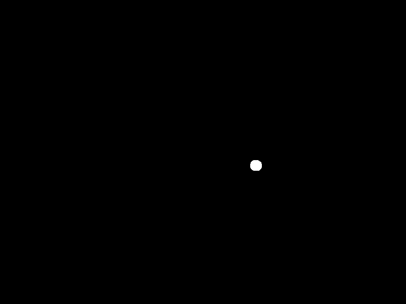

#### Who's turn is it anyway?

Augmented reality board games.

@davetapley

+++

Disclaimer:

Just because you can...

+++

But it's been a lot of fun.

---


+++

# Demo time

_Show people playing via camera_

+++

#### The track

* Six straights
* Ten corners

+++

Trivia:

* 630 combinations

+++

#### There are walls

* Around the outside of corners
* On _one side_ of each straight

+++

### Leaving the track

It happens

Go back to where you were before

_Demo_

+++

* Remembering is hard
* Especially impartial remembering

+++

_Let's have computers do it_

---

#### The goal

* Capture webcam images
* Show the positions

+++

#### Capturing webcam images


https://developer.mozilla.org/en-US/docs/Web/API/WebRTC_API/Taking_still_photos

+++


+++

Let's try **Vue.js**.

+++

#### Processing images

In Ruby?

+++

Use **OpenCV**

* C/C++ image processing library

* Has a Ruby wrapper:
  https://github.com/ruby-opencv

+++

#### Be real time

Did someone say **ActionCable**?

+++

### Let's use

|                                      |              |
|--------------------------------------|--------------|
| Video acquisition and rendering      | WebRTC & Vue.js       |
| Image processing                     | OpenCV via Ruby binding      |
| Real time asynchronous communication | ActionCable |

---

#### The plan

1. Get an image
1. ActionCable to server
1. Find cars
1. Who moved?
1. Results

+++

#### Get an image


https://github.com/smronju/vue-webcam

+++

HTML


```html
 <vue-webcam ref='webcam'></vue-webcam>
 <button type="button" @click="take_photo">Take Photo</button>
 
```

+++

JS

```javascript
methods: {
  take_photo () {
    this.photo = this.$refs.webcam.getPhoto();
  }
}
```

What is `this.photo`?

+++

#### Data URIs


https://developer.mozilla.org/en-US/docs/Web/HTTP/Basics_of_HTTP/Data_URIs

+++


http://rubyonrails.org/images/imagine.png

+++


https://dopiaza.org/tools/datauri/index.php

+++


+++

```html

```

It does actually work!

---

1. ~~Get an image~~ &#10004;
1. ActionCable to server
1. Find cars
1. Who moved?
1. Results

+++

Get a **Vue.js** component working with **ActionCable**


+++

#### ActionCable and Vue.js

1. Get ActionCable JS in Vue
2. Subscribe to a channel
3. Send image as data URI

+++

1: Get ActionCable JS in Vue.js

```javascript
import ActionCable from 'actioncable'

const cable = ActionCable.createConsumer('wss://' +
  process.env.RAILS_URL.replace(/.*?:\/\//g, '') +
  '/cable')

Vue.prototype.$cable = cable
```

+++
2: Subscribe to a channel
```javascript
created () {
  this.videoChannel = this.$cable.subscriptions.create(
    { channel: 'VideoChannel' }, ...
```

+++

3: Send image
```javascript
   this.videoChannel.send({ image: uriEncodedImage })
```
```ruby
class VideoChannel < ApplicationCable::Channel
  def receive(data)
    uri_encoded_image = data['image']
  end
end
```

+++

#### This is very cool

```
+-----------------------+
|                       |
|   +--------------+    |  action   +----------+
|   |              |    |  cable    |          |
|   |  <element>   | +------------> |  Rails   |
|   |              |    |           |          |
|   |  </element>  | <------------+ |  server  |
|   |              |    |           |          |
|   +--------------+    |           +----------+
|                       |
+-----------------------+

```

+++

#### Wiring it up

```javascript
methods: {
  take_photo () {
    this.photo = this.$refs.webcam.getPhoto()
    this.videoChannel.send({image: this.photo})
  }
}
```

+++

#### Did it work?

Yes, but...

+++


---

1. ~~Get an image~~ &#10004;
1. ~~ActionCable to server~~ &#10004;
1. Find cars
1. Who moved?
1. Results

+++

#### Load it in to OpenCV

+++


+++


+++


+++


+++


+++

```ruby
class VideoChannel < ApplicationCable::Channel

  def receive(data)
    uri = URI::Data.new data['image_uri']
    data = uri.data
    File.open('image.jpg', 'wb') { |f| f.write(data) }
    image = IplImage.load 'image.jpg'
```

+++


+++


+++


+++


http://www.think-maths.co.uk/spreadsheet

+++


+++


 # 00 80 FF

+++


```ruby
blue = CvScalar.new 0x00, 0x80, 0xFF
mask = image.eq blue
```

+++

```ruby
mask.save_image 'tmp/output.png'
mask_data = File.open('tmp/output.png', 'rb').read
mask_base64 = Base64.strict_encode64 mask_data

mask_uri = "data:image/png;base64,#{mask_base64}"
```

+++


+++


+++


+++


+++

```ruby
ColorChannel.broadcast_to 'blue' mask_uri: mask_uri
```

+++
```javascript
this.channel = this.$cable.subscriptions.create({ channel: 'ColorChannel' }, {
  received (data) {
    this.mask_uri = data.mask_uri
```

```html
 
```

+++


```html
<input v-model="range.red.min" @change="setHSV" />
<input v-model="range.red.max" @change="setHSV" />

<input v-model="range.green.min" @change="setHSV" />
<input v-model="range.green.max" @change="setHSV" />

<input v-model="range.blue.min" @change="setHSV" />
<input v-model="range.blue.max" @change="setHSV" />
```

```javascript
methods: {
  setHSV: function () {
    this.channel.perform('setHSV', { range: this.range })
```

+++

```ruby
class VideoChannel < ApplicationCable::Channel
  def receive(data)
    range = JSON.parse data['range']
    min = CvScalar.new range['red']['min'], ...
    max = CvScalar.new range['red']['max'], ...
    ....
    mask = image.in_range min, max
  end
end

+++


+++

+++



+++


+++

### It's there:


