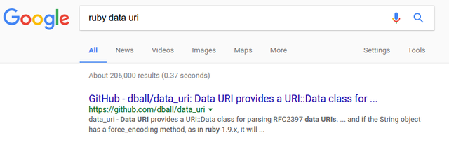
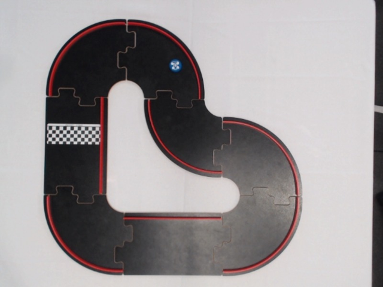
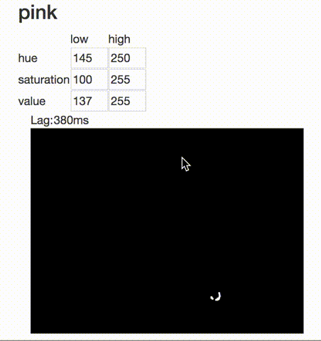
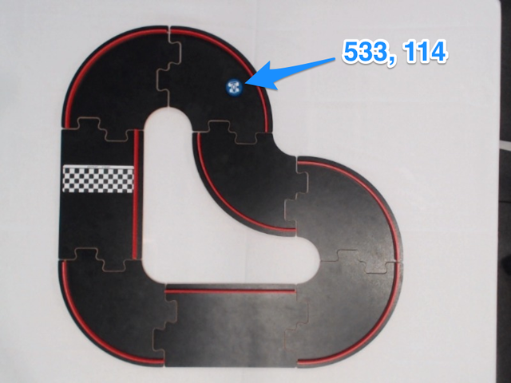
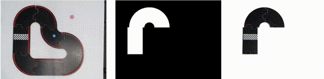

#### Who's turn is it anyway?

Augmented reality board games.

<i class="fa fa-twitter" aria-hidden="true"></i> @davetapley

+++

#### Disclaimer:

Just because you can...

+++

But it's been a lot of fun.

---


+++

#### Demo

+++

#### The track

* Six straights
* Ten corners
* 630 combinations <!-- .element: class="fragment" -->

+++

#### There are walls

* Around the _outside_ of corners
* On _one side_ of each straight

+++

#### Leaving the track

* It happens, it's annoying, but inevitable
* Go back to where you were

+++

* Remembering is hard
* Especially impartial remembering

+++

_Let's have computers do it_

---

#### The goal

* Capture images 
* Show positions if necessary

+++

#### Capturing webcam images


<small>https://developer.mozilla.org/en-US/docs/Web/API/WebRTC_API/Taking_still_photos</small>

+++


+++


Let's try **Vue.js**.

+++

#### Processing images

In Ruby?

+++

Use **OpenCV**

* C/C++ image processing library

* Has a Ruby wrapper:

  https://github.com/ruby-opencv

+++

#### Be real time

Did someone say **ActionCable**?

+++

#### Let's use

|                 |              |
|-----------------|--------------|
| Front end       | WebRTC & Vue.js       |
| Back end        | OpenCV |
| Communication   | ActionCable |

---

#### The plan

1. Get an image
1. ActionCable to server
1. Load into OpenCV
1. Find the cars
1. Who fell off?

+++

#### Get an image


<small>https://github.com/smronju/vue-webcam</small>

+++

HTML


```html
 <vue-webcam ref='webcam'></vue-webcam>
 <button type="button" @click="take_photo">Take Photo</button>
 
```

+++

JS

```javascript
methods: {
  take_photo () {
    this.photo = this.$refs.webcam.getPhoto();
  }
}
```

What is `this.photo`?

+++

#### Data URIs


<small>https://developer.mozilla.org/en-US/docs/Web/HTTP/Basics_of_HTTP/Data_URIs</small>

+++


<small>http://rubyonrails.org/images/imagine.png</small>

+++


<small>https://dopiaza.org/tools/datauri/index.php</small>

+++


+++

HTML

```html
 
```

---

1. ~~Get an image~~ &#10004;
1. ActionCable to server
1. Load into OpenCV
1. Find the cars
1. Who fell off?

+++

Get a **Vue.js** component working with **ActionCable**

+++


+++

1. Get ActionCable JS in Vue
2. Subscribe to a channel
3. Send image as data URI

+++

JS

```javascript
import ActionCable from 'actioncable'

const cable = ActionCable.createConsumer('wss://' +
  process.env.RAILS_URL.replace(/.*?:\/\//g, '') +
  '/cable')

Vue.prototype.$cable = cable
```

+++

JS

```javascript
created () {
  this.videoChannel = this.$cable.subscriptions.create(
    { channel: 'VideoChannel' }, ...
```

+++

JS

```javascript
this.videoChannel.send({ image: uriEncodedImage })
```

Ruby

```ruby
class VideoChannel < ApplicationCable::Channel
  def receive(data)
    uri_encoded_image = data['image']
  end
end
```

+++

#### This is very cool

```
+-----------------------+
|                       |
|   +--------------+    |  action   +----------+
|   |              |    |  cable    |          |
|   |  <element>   | +------------> |  Rails   |
|   |              |    |           |          |
|   |  </element>  | <------------+ |  server  |
|   |              |    |           |          |
|   +--------------+    |           +----------+
|                       |
+-----------------------+

```

+++

JS

```javascript
methods: {
  take_photo () {
    this.photo = this.$refs.webcam.getPhoto()
    this.videoChannel.send({image: this.photo})
  }
}
```

+++

#### Did it work?

Yes, but...

+++


---

1. ~~Get an image~~ &#10004;
1. ~~ActionCable to server~~ &#10004;
1. Load into OpenCV
1. Find the cars
1. Who fell off?

+++


+++


+++


+++



+++


<small>https://github.com/dball/data_uri/blob/master/lib/data_uri/uri.rb</small>

+++

Ruby

```ruby
class VideoChannel < ApplicationCable::Channel
  def receive(data)
    uri = URI::Data.new data['image_uri']
    data = uri.data # aka after the comma

    File.open('image.jpg', 'wb') do |f|
      f.write data
    end

    image = IplImage.load 'image.jpg'
```

+++



```ruby
image = IplImage.load 'image.jpg'
```

+++


+++


+++


<small>http://www.think-maths.co.uk/spreadsheet</small>

---

1. ~~Get an image~~ &#10004;
1. ~~ActionCable to server~~ &#10004;
1. ~~Load into OpenCV~~ &#10004;
1. Find the cars
1. Who fell off?

+++


```ruby
image = IplImage.load 'image.jpg'
```

+++


+++


```ruby
blue = CvScalar.new 0x00, 0x80, 0xFF
mask = image.eq blue
```

+++


+++


More data URIs

```ruby
mask.save_image 'tmp/output.png'
mask_data = File.open('tmp/output.png', 'rb').read
mask_base64 = Base64.strict_encode64 mask_data

mask_uri = "data:image/png;base64,#{mask_base64}"
```

+++


```html
 
```


+++


+++


+++

1. Visualize the mask with some `min` and `max`
1. Edit the `min` and `max`

+++

Ruby

```ruby
mask = image.in_range min, max
...
mask_uri = "data:image/png;base64,#{mask_base64}"
ColorChannel.broadcast_to 'blue' mask_uri: mask_uri
```

+++

JS

```javascript
this.channel = this.$cable.subscriptions.create(
  { channel: 'ColorChannel' }, {
    received (data) {
      this.mask_uri = data.mask_uri
```

HTML

```html
 
```

+++

1. ~~Visualize the mask with some `min` and `max`~~ &#10004;
1. Edit the `min` and `max`

+++

HTML

```html
<input v-model="range.red.min" @change="setHSV" />
<input v-model="range.red.max" @change="setHSV" />

<input v-model="range.green.min" @change="setHSV" />
<input v-model="range.green.max" @change="setHSV" />

<input v-model="range.blue.min" @change="setHSV" />
<input v-model="range.blue.max" @change="setHSV" />
```

JS

```javascript
methods: {
  setHSV: function () {
    this.channel.perform('set_hsv_range', { range: this.range })
```

+++

Ruby

```ruby
class VideoChannel < ApplicationCable::Channel
  def set_hsv_range(data)
    range = JSON.parse data['range']
    min = CvScalar.new range['red']['min'], # ...
    max = CvScalar.new range['red']['max'], # ...
    # ....
    mask = image.in_range min, max
  end
end
```

+++



+++

Yes but where?



+++


+++

```ruby
circles = mask.hough_circles # ...
car = circles.first
if car
  CarChannel.broadcast_to 'blue', x: car.x, y: car.y
else
  CarChannel.broadcast_to 'blue', missing: true
end
```

+++

It's there:


---

1. ~~Get an image~~ &#10004;
1. ~~ActionCable to server~~ &#10004;
1. ~~Load into OpenCV~~ &#10004;
1. ~~Find the cars~~&#10004;
1. Who fell off?

+++


+++

#### Be lazy

1. On the track
1. Everywhere else

+++

#### Mask 2: Track Mask


+++


+++

#### The making of a mask

Start at the beginning

Draw a rectangle

+++

Where?

1. Position
1. Rotation
1. Scale

+++

_gif of positioning start tile_

+++


S&#10004; L S L L R L L

+++

Figure out where the next piece  goes:

1. Position: One _scale_ along
1. Rotation: Same as the start
1. ~~~Scale~~~ (always the same)

+++

_gif of building up a circle_

+++

_image of mask with S L_

+++


Figure out where the next-next piece goes:

1. Position: One _scale_ along, and one _scale_ down
1. Rotation: Quarter turn to the left

+++



+++

1. Store where we last saw a car
1. Show where they are, or:
1. Show where they were.

+++

1. ~~Get an image~~ &#10004;
1. ~~ActionCable to server~~ &#10004;
1. ~~Load into OpenCV~~ &#10004;
1. ~~~Find the cars~~~&#10004;
1. ~~~Who fell off?~~~&#10004;

---

DEMO

+++

### Errata

1. More accurate track masking
1. HSV > RGB
1. Null track image removal
1. Panic mode
1. Frame smoothing
1. Turn detection

+++

* Questions?
* Comments?
* Feedback?

<i class="fa fa-twitter" aria-hidden="true"></i> @davetapley

https://github.com/dukedave/pitchcam-rails
